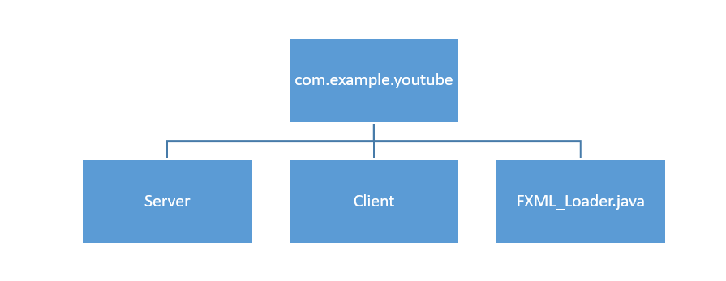
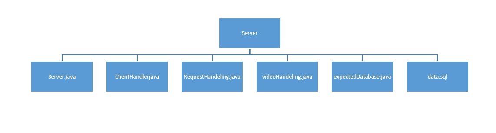
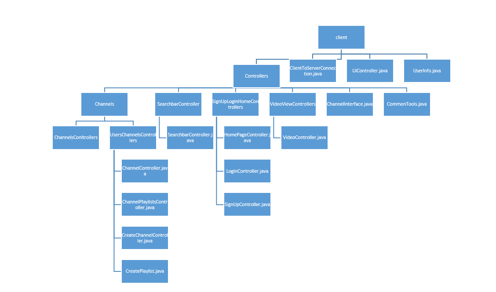

# Project README
This project has been developed by a team of two members. One member is responsible for the Frontend, and the other member is responsible for the Backend.

## Project Details:
- Package Manager: The project uses Maven as its package manager.
## Project Structure:
The project is organized into two separate packages: Server and Client.
To facilitate communication between these packages and the Resources section, an FXML_Loader file has been created. This file enables interaction with the Resources section.

## Execution:
- Server: The server runs in the Server class.
- 
- Client: The client runs in the ClientToServerConnection class.
- 
- When a user runs ClientToServerConnection on the client side, an instance of Userinfo is created for that user.
- Following this, the LogIn and SignUp scenes are displayed to the user.
- At this stage, an instance of UIController is created to handle the subsequent user requests.
## Usage Instructions:
1- Setting Up the Project:

- Ensure Maven is installed and configured on your system.
2- Running the Server:

- Navigate to the server package.
Run the Server class to start the server.
3- Running the Client:

- Navigate to the client package.
- Run the ClientToServerConnection class.
- Upon running, an instance of Userinfo is created.
- The LogIn and SignUp scenes will be presented to the user.
- An instance of UIController will be created to manage further user requests.
## Important Classes:
- Server: Handles server-side operations.
- ClientToServerConnection: Manages client-side operations and establishes connection with the server.
- FXML_Loader: Facilitates communication between the client, server, and resources.
- Userinfo: Represents user information and is instantiated for each client connection.
- UIController: Manages user interface interactions and processes user requests.

